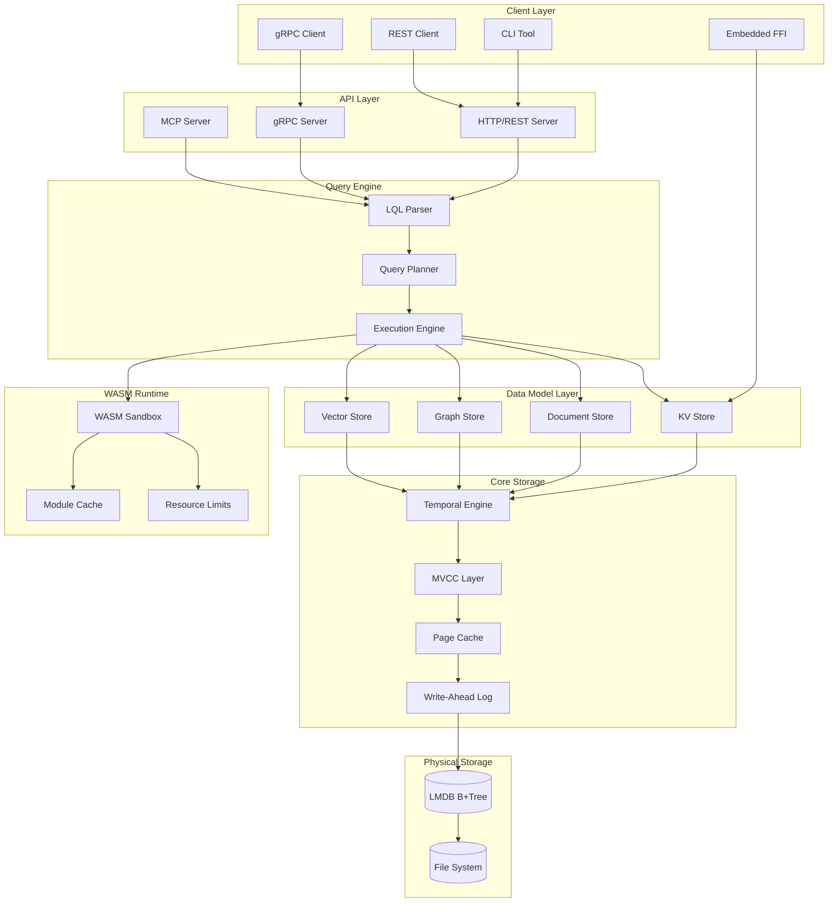

# LLMDB System Architecture

This document provides a technical deep-dive into LLMDB's system architecture, component interactions, and design patterns.

## Architecture Overview

LLMDB follows a layered architecture pattern with clear separation of concerns:



## Component Descriptions

### 1. Client Layer

#### CLI Tool (`llmdb` command)
- Interactive REPL for database operations
- Batch processing capabilities
- Administrative commands (backup, restore, repair)
- Performance profiling and debugging tools

#### REST Client
- HTTP/JSON interface for language-agnostic access
- RESTful resource modeling
- OpenAPI specification compliance
- Streaming support for large result sets

#### gRPC Client
- High-performance binary protocol
- Streaming bidirectional communication
- Protocol buffer schema definitions
- Connection pooling and load balancing

#### Embedded FFI
- Direct in-process library usage
- Zero serialization overhead
- Memory-mapped data access
- Language bindings (Python, Rust, C)

### 2. API Layer

#### HTTP/REST Server
```python
# FastAPI-based REST endpoints
@app.get("/api/v1/kv/{key}")
async def get_key(key: str, as_of: Optional[datetime] = None):
    """Get value with optional temporal query"""
    
@app.post("/api/v1/query")
async def execute_query(query: LQLQuery):
    """Execute LQL query and return results"""
```

#### gRPC Server
```protobuf
service LLMDBService {
  rpc Get(GetRequest) returns (GetResponse);
  rpc Put(PutRequest) returns (PutResponse);
  rpc Query(QueryRequest) returns (stream QueryResponse);
  rpc ExecuteWASM(WASMRequest) returns (WASMResponse);
}
```

#### MCP Server
- Model Context Protocol implementation
- Agent-friendly endpoints
- Schema discovery and introspection
- Dynamic schema evolution support

### 3. Query Engine

#### LQL Parser
- SQL-compatible syntax with temporal extensions
- Abstract syntax tree (AST) generation
- Semantic analysis and validation
- Error reporting with suggestions

```sql
-- Example LQL query
SELECT user.name, COUNT(events.*)
FROM users user
JOIN events ON events.user_id = user.id
WHERE user.created_at AS OF VALID '2024-01-01'
AND events.timestamp BETWEEN VALID '2024-01-01' AND '2024-12-31'
EMBEDDED WASM aggregate_stats('monthly')
GROUP BY user.id
LIMIT 100;
```

#### Query Planner
- Cost-based optimization
- Temporal predicate pushdown
- Index selection and usage
- Join order optimization
- WASM integration planning

#### Execution Engine
- Vectorized operations where possible
- Streaming result processing
- Resource management and quotas
- Progress reporting and cancellation

### 4. Data Model Layer

#### KV Store (Core)
```python
class TemporalKV:
    def get(self, key: Key, as_of: Optional[datetime] = None) -> Optional[Value]:
        """Get current or historical value"""
        
    def put(self, key: Key, value: Value, valid_from: datetime) -> None:
        """Insert with bitemporal versioning"""
        
    def scan(self, prefix: bytes, time_range: TimeRange) -> Iterator[Tuple[Key, Value]]:
        """Scan with temporal predicates"""
```

#### Document Store
- JSON/BSON document projection
- Schema validation and evolution
- Nested field indexing
- MongoDB-like query interface

#### Graph Store
```python
class GraphStore:
    def add_node(self, node_id: NodeId, properties: Dict) -> None:
        """Add node with properties"""
        
    def add_edge(self, from_node: NodeId, to_node: NodeId, 
                 edge_type: str, properties: Dict) -> EdgeId:
        """Add typed edge between nodes"""
        
    def traverse(self, start: NodeId, pattern: TraversalPattern) -> Iterator[Path]:
        """Graph traversal with pattern matching"""
```

#### Vector Store
- Dense vector storage (f32 arrays)
- SIMD-optimized operations
- Approximate nearest neighbor search
- Hybrid symbolic+vector queries

### 5. Core Storage

#### Temporal Engine
```python
class TemporalEngine:
    def __init__(self, clock: Clock):
        self.valid_time_index = BTreeIndex()
        self.transaction_time_index = BTreeIndex()
        
    def query_as_of_valid(self, timestamp: datetime) -> QueryContext:
        """Create query context for specific valid time"""
        
    def query_between_valid(self, start: datetime, end: datetime) -> QueryContext:
        """Create query context for valid time range"""
```

#### MVCC Layer
- Snapshot isolation for readers
- Copy-on-write for writers  
- Garbage collection of old versions
- Deadlock detection and resolution

#### Page Cache
- LRU eviction policy
- Write-back caching
- Prefetching for sequential access
- Memory pressure handling

#### Write-Ahead Log
- Durability guarantees
- Group commit optimization
- Log shipping for replication
- Point-in-time recovery

### 6. WASM Runtime

#### WASM Sandbox
```python
class WASMSandbox:
    def __init__(self, config: SandboxConfig):
        self.engine = wasmtime.Engine()
        self.fuel_limit = config.fuel_limit
        self.memory_limit = config.memory_limit
        
    def execute(self, module: WASMModule, function: str, args: List[Any]) -> Any:
        """Execute WASM function with resource limits"""
```

#### Module Cache
- Compiled module caching
- Hot reload support
- Version management
- Dependency resolution

#### Resource Limits
- CPU time limits (fuel metering)
- Memory consumption limits
- Stack depth limits
- Syscall restrictions

### 7. Physical Storage

#### LMDB Integration
- Single-file database
- ACID transactions  
- Memory-mapped I/O
- Zero-copy reads
- Crash recovery

## Data Flow Patterns

### Write Path
1. Client sends write request
2. API layer validates and authenticates
3. Query engine plans the operation
4. Temporal engine assigns timestamps
5. MVCC layer handles concurrency
6. WAL records the operation
7. Page cache updates in memory
8. Background process flushes to LMDB
9. Response returned to client

### Read Path  
1. Client sends read request
2. API layer validates and authenticates
3. Query engine parses temporal predicates
4. MVCC layer creates snapshot
5. Temporal engine applies time filters
6. Page cache serves data (or loads from LMDB)
7. Data model layer projects results
8. WASM functions process data (if requested)
9. Results streamed back to client

### WASM Execution Path
1. Query includes WASM function call
2. Module cache retrieves compiled module
3. Sandbox creates isolated instance
4. Resource limits are configured
5. Function executes with data slice
6. Results collected and validated
7. Resource usage tracked and reported
8. Sandbox instance destroyed

## Concurrency Model

### Reader-Writer Locks
- Multiple concurrent readers
- Single writer with exclusive access
- Reader-writer preference configuration
- Deadlock avoidance through ordering

### Transaction Isolation
- Read committed (default)
- Repeatable read (snapshot isolation)
- Serializable (full isolation)
- Read uncommitted (performance mode)

### WASM Concurrency
- Isolated per-invocation sandboxes  
- No shared state between executions
- Deterministic execution model
- Resource consumption tracking

## Error Handling

### Error Categories
```python
class LLMDBError(Exception):
    """Base class for all LLMDB errors"""

class ValidationError(LLMDBError):
    """Input validation failures"""

class AuthenticationError(LLMDBError):  
    """Authentication failures"""

class ResourceExhausted(LLMDBError):
    """Resource limit exceeded"""

class WASMExecutionError(LLMDBError):
    """WASM sandbox execution failure"""

class TemporalError(LLMDBError):
    """Temporal consistency violation"""
```

### Recovery Strategies
- Automatic retry with exponential backoff
- Circuit breaker pattern for external dependencies
- Graceful degradation during resource exhaustion
- Checkpoint/restore for long-running operations

## Performance Characteristics

### Latency Targets
- Point queries: < 60µs p99
- Range scans: < 1ms/1000 records
- Temporal queries: < 100µs overhead
- WASM execution: < 25ms per function

### Throughput Targets  
- Reads: > 1M ops/sec
- Writes: > 250MB/sec  
- WASM maps: > 8M pages/sec
- Concurrent connections: > 10,000

### Scalability Limits
- Database size: 128TB (64-bit addressing)
- Key length: 511 bytes (LMDB limit)
- Value size: 2GB (practical limit)
- Temporal history: Unlimited (with cleanup)

## Monitoring and Observability

### Metrics
- Request latency histograms
- Throughput counters
- Error rates by category
- Resource utilization
- WASM execution statistics

### Tracing
- Distributed tracing with OpenTelemetry
- Request correlation across components
- Performance bottleneck identification
- WASM execution traces

### Logging
- Structured JSON logging
- Configurable log levels
- Audit trail for security events
- Performance event logging

This architecture supports LLMDB's goals of being fast, flexible, and LLM-friendly while maintaining strong consistency, security, and observability.